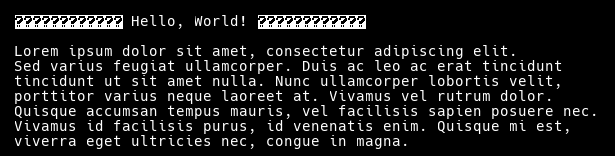
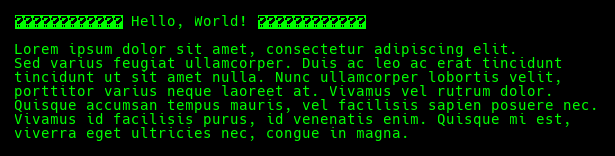
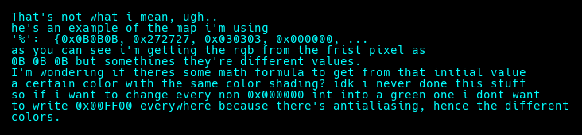

# PPMWriter
- Used to write text to a ppmimage
- Only supports ascii characters defined in mfont.go, any other codepoint is replaced with the inverted "?"
- No external FONTS/Libraries used, only depends on stdlib
## Also supports colored text

## Convert .ppm to .png/.jpeg
Depends on ffmpeg
